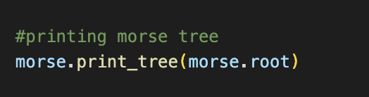

# **WORKSHEET2 - MORSE TREE**


A python module that creates a binary tree for morse code. By using that module you can do translation between morse code and sentence. 
 

The Morse tree is a binary tree where each node represents a symbol in Morse code, either a dot or a dash. The root node represents the null character, and the left child of each node represents a dot, while the right child represents a dash.
 
 
This is what a binary tree morse code looks like:

 

---
## **Implementations**
---

**Morse Tree Implementation :** *is_empty(), is_not empty(), insert(), find(), decode(), encode(), print_tree() functions are available.*

**Unit Test Implementation:** *Test are done using assertIn(), assertNotIn(), assertEqual(), assertNotEqual(), assertCountEqual(), assertTrue(), assertFalse(), assertIs(), assertIsNot().*


---

Resimler:
---



CODE :           |  TERMINAL PRINT:
:-------------------------:|:-------------------------:
.... | ..

## **Example Usage**
---
### Under Main.py, user can translator from text to morse and morse to text.
### **Code**:
```python
#messages
print('--------TEXT TO MORSE-------------')
text_message = input(('Enter text to encode ==> '))
encoded = morse.encode(text_message)
print('Encoded message: ' + encoded)

print('--------MORSE TO TEXT-------------')
morse_message = input(('Enter morse to decode ==> '))
decoded = morse.decode(morse_message)
print('Decoded message: ' + decoded) 
```
### **Terminal Print**:


 ### Under Main.py, user can print morse tree.
 ### **Code**:


## Installation
Within a particular ecosystem, there may be a common way of installing things, such as using Yarn, NuGet, or Homebrew. However, consider the possibility that whoever is reading your README is a novice and would like more guidance. Listing specific steps helps remove ambiguity and gets people to using your project as quickly as possible. If it only runs in a specific context like a particular programming language version or operating system or has dependencies that have to be installed manually, also add a Requirements subsection.

## Usage
Use examples liberally, and show the expected output if you can. It's helpful to have inline the smallest example of usage that you can demonstrate, while providing links to more sophisticated examples if they are too long to reasonably include in the README.


## **Referencing**