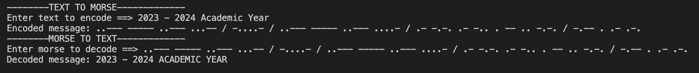
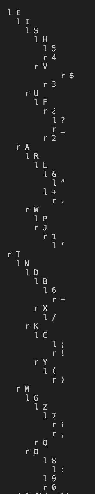
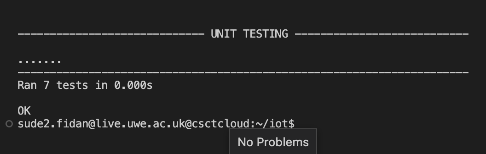

# **WORKSHEET2 - MORSE TREE**
## 🚀 **Getting Started**

This repository contains python module that creates a binary tree for morse code. By using that module you can do translation between morse code and sentence. 

The Morse tree is a binary tree where each node represents a symbol in Morse code, either a dot or a dash. The root node represents the null character, and the left child of each node represents a dot, while the right child represents a dash.
 
This is what a binary tree morse code looks like:

 

## 🔧 **Implementations**
**Morse Tree Implementation :** *Tree is implemented with is_empty(), is_not empty(), insert(), find(), decode(), encode(), print_tree() functions.*

**Unit Test Implementation:** *Test are done using assertIn(), assertNotIn(), assertEqual(), assertNotEqual(), assertCountEqual(), assertTrue(), assertFalse(), assertIs(), assertIsNot().*
## 🎯 **Features**
* Translation from morse code to text (decoding)
* Translation from text to morse code(encoding).
* Inserting new characters in to tree and dictionary.
* Printing morse tree with each node's position.
* Finding characters in morse tree.
* Check if tree is empty.
* Check if tree is not empty.
* Unit testing.

## 🖇️ **Example Usage**

📍 Main.py

User can translator from text to morse and morse to text:
```python
#messages
print('--------TEXT TO MORSE-------------')
text_message = input(('Enter text to encode ==> '))
encoded = morse.encode(text_message)
print('Encoded message: ' + encoded)

print('--------MORSE TO TEXT-------------')
morse_message = input(('Enter morse to decode ==> '))
decoded = morse.decode(morse_message)
print('Decoded message: ' + decoded) 
```
Expected Output:



Here is some other examples with their expected output to try:
Text  | Morse
------------- | -------------
Sude Fidan  | ... ..- -.. . / ..-. .. -.. .- -.
2023 + 2017 | ..--- ----- ..--- ...-- / .-.-. / ..--- ----- .---- --..
WE LOVE PC ! | .-- . / .-.. --- ...- . / .--. -.-. / -.-.--


User can also print morse tree with their position:
```python

#printing morse tree
morse.print_tree(morse.root)
```
Expected Output:



## 💡 **Unit Testing**
📍 Morseunit.py

Program has some unit testing if user wants to test. There are 7 tests available:

1. Testing for encode() function

    Encode function translate from text to morse. Here are the examples that are done under testing:
    Assert Function | Message         | Encoded Version     | Message 2   | Comparision
    -------------   | ------------- | ------------- | ------------- | ------------- 
    assertIn() | here | .... . .-. . | .. / .- -- / .... . .-. . | True 
    assertEqual() | Sude Fidan | ... ..- -.. . / ..-. .. -.. .- -. |... ..- -.. . / ..-. .. -.. .- -.| True
    assertCountEqual() | 2023 | ..--- ----- ..--- ...-- | ..--- ----- ..--- ...-- | True
    assertEqual() | 2023 + 2017 | ..--- ----- ..--- ...-- / .-.-. / ..--- ----- .---- --... | ..--- ----- ..--- ...-- / .-.-. / ..--- ----- .---- --... | True
    assertEqual()| FIDAN | ..-. .. -.. .- -. | ..-. .. -.. .- -.| True
    assertEqual()| WE LOVE PC ! | .-- . / .-.. --- ...- . / .--. -.-. / -.-.-- | .-- . / .-.. --- ...- . / .--. -.-. / -.-.--| True
    assertNotIn() | benedict |-... . -. . -.. .. -.-. - | -... . -. . -.. | False
    assertNotEqual() | internet of the things | .. -. - . .-. -. . - / --- ..-. / - .... . / - .... .. -. --. ... | .. -. - . .-. -. . - / --- ..-. / - .... . / - .... .. -. --. | False

2. Testing for decode() function

    Decode function translate from morse to text. Here are the examples that are done under testing:

    Assert Function | Message         | Decoded Version     | Message 2   | Comparision
    -------------   | ------------- | ------------- | ------------- | ------------- 
    assertIn() | ... ..-. | SF| SF IS MY CAPITALS | True 
    assertEqual()| ...- ... -.-. --- -.. . | VSCODE |VSCODE|True
    assertCountEqual() |- .... . / . -. -.. | THE END | THE END| True
    assertEqual() | ..--- ----- ..--- ...-- / -....- / ..--- ----- ..--- ....- | 2023 - 2024 | 2023 - 2024| True
    assertNotEqual() | .. -. - . .-. -. | INTERN | INTERNET| False
    assertNotIn() | - .... .. -. --. . | THINGE | I WAS BORN IN 2002 |False


3. Testing for is_empty() function:
   
    Is_Empty function returns True if tree is empty. Our morse code tree is already populated under constructor so it is not empty so function will return False.

    Assert Function | Function | True/False
    -------------   | ------------- | -------------  
    assertFalse() | tree.is_empty() | True 

4. Testing for is_not_empty() function:

    Is_Not_Empty function returns True if tree is not empty. Our morse code tree is already populated under constructor so it is not empty so function will return True.

    Assert Function | Function | True/False
    -------------   | ------------- | -------------  
    assertTrue() | tree.is_not_empty() | True 

5. Testing for find() function:

    Find function finds the character from morse code inside of morse dictionary.

    Assert Function | Char | Decoded Version | Location | True/False
    -------------   | ------------- | -------------  | ------------- | -------------
    assertIn() | .- | A | *morse.dictionary* | True 
    assertIn() | ...| S | SUDE| True 

1. Testing for insert() function:

    Insert function inserts new character to tree with its node and to dictionary.

    Assert Function | Symbol | Morse | Is Inserted ?| True/False
    -------------   | ------------- | -------------  | ------------- | ------------- 
    assertNotIn() | @ | .--.-. |No | True 
    assertIn() | @| .--.-.| Yes | True
    assertNotIn() | *Not Valid* | .........| No | True 

7. Testing for additional symbols:

    Symbol | Morse | Symbol | Morse | Symbol | Morse 
    -------------   | ------------- | -------------   | -------------   | ------------- | -------------   
    . | .-.-.- | ( |-.--. | , | .-.-.- | ) | -.--.-
    ! | -.-.-- | ¡ | --...- | -|-....- | _ |..--.-
    +| .-.-. | ? | ..--.. | ¿ | ..-.- | & | .-...
    ’ |  .----. | :| ---... |  ;| -.-.-. | ”| .-..-.
    $ |...-..-

    Above additional symbols are added to morse dictionary and tree.

    Assert Function | Message         | Translation     | Message 2   | Comparision
    -------------   | ------------- | ------------- | ------------- | ------------- 
    assertEqual() | .-.-.- | . | . | True
    assertEqual() | ..--.- | _ | _ | True
    assertIs() | -....- | - | - | True 
    assertIs() | --...- | ¡ | ¡| True
    assertEqual() | ..--.. -.-.-- | ?! | ?!| True
    assertEqual() | -.--. / -.--.- | ( ) | ( )| True
    assertIn() | ...-..- | $| $€£ | True
    assertIn() | .----.| ’| ’| True
    assertIn() | ---...| : | *morse.dictionary* | True
    assertIn() | + | .-.-. | *morse.dictionary* | True
    assertCountEqual() | & | .-... | .-... | True
    assertCountEqual() | - | -....- | -....- | True
    assertNotIn() | ¿¿¿ | ..-.- ..-.- ..-.- | *morse.dictionary* | False
    assertNotEqual() | -.-.-. | ;| A | False
    assertNotEqual() | -.-.-. | *Not Valid* | ” | False
    assertIsNot() | , | --..-- | ..--.- | False


After running all tests expected output:



## 📚 **Library** 
Here is the library for unit testing: [unittest](https://docs.python.org/3/library/unittest.html)
## 📪 **Installation** 
User does not need to install any packages.

## 🤓 **Maintainers** 
Sude Fidan(@s2-fidan)
## 📖  **Referencing** 
* https://morsecode.world/international/translator.html
* https://www.geeksforgeeks.org/morse-code-translator-python/
* https://www.101computing.net/morse-code-using-a-binary-tree/
* https://trinket.io/python/36832c4c5d
* https://github.com/adam-p/markdown-here/wiki/Markdown-Cheatsheet#links
